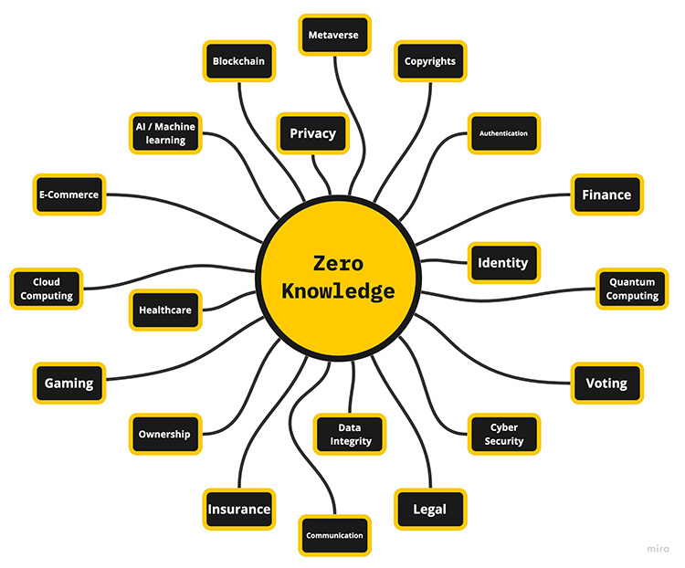

# 应用

展示 zk 技术各种应用的材料合集。

---

## 通用

- [密码学证明的寒武纪爆发 - Ben Sasson](https://nakamoto.com/cambrian-explosion-of-crypto-proofs/)
- [使用 ZKP 对抗虚假信息 - Boneh, Datta](https://medium.com/@boneh/using-zk-proofs-to-fight-disinformation-17e7d57fe52f)
- [用于投票的 ZKP - Phil Kelly](https://blog.o1labs.org/zero-knowledge-proofs-for-voting-3c6a6d5d89db)

## ZK Rollups EVMs/VMs

- **通用**
  - [什么是 ZK EVM](https://www.alchemy.com/overviews/zkevm)
  - [zkEVM 社区版](https://mirror.xyz/privacy-scaling-explorations.eth/I5BzurX-T6slFaPbA4i3hVrO7U2VkBR45eO-N3CSnSg)
  - [Ethworks：区块链扩展](https://ethworks.io/assets/download/zero-knowledge-blockchain-scaling-ethworks.pdf)
  - [以太坊驱动的 ZK-Rollups：世界领先](https://hackmd.io/QkOUJ-UJQ-CJ7cs_yx6_GA)
  - [以太坊 - 可扩展性](https://www.taurushq.com/insights/20220131_Taurus_scalability_L2_part1/EthereumL2_Scalability_part1.pdf)
  - [ZK Rollups 不完全指南](https://vitalik.ca/general/2021/01/05/rollup.html#:~:text=One%20important%20compression,SNARKs%20are%20valid.)
  - [去中心化的 zk-Rollup](https://hackmd.io/SzneKXSWRJ6yJxzgFm9MwQ?view)
  - [ZK Rollups 流行](https://limechain.tech/blog/optimistic-rollups-vs-zk-rollups/)
  - [以太坊：ZK Rollups](https://ethereum.org/ph/developers/docs/scaling/zk-rollups/)
  - [ZK Rollups 的工作原理：Simon Brown](https://medium.com/fcats-blockchain-incubator/how-zk-rollups-work-8ac4d7155b0e)
  - [Danksharding 概述](https://a16zcrypto.com/content/article/an-overview-of-danksharding-and-a-proposal-for-improvement-of-das/)
- **EVM/VMs**
  - [Aztec 协议](https://aztec.network)
  - [Scroll EVM](https://scroll.io)
  - [Taiko EVM](https://taiko.xyz/)
  - [zkSync](https://docs.zksync.io/userdocs/)
  - [Polygon zkEVM](https://polygon.technology/solutions/polygon-zkevm/)
  - [Miden VM](https://wiki.polygon.technology/docs/miden/intro/main)
    - [Miden VM 中的范围检查](https://hackmd.io/D-vjBYtHQB2BuOB-HMUG5Q)
    - [Miden VM 程序解码器](https://hackmd.io/_aaDBzbWRz6EwQQRtK1pzw)
    - [Miden VM 中的内存](https://hackmd.io/@bobbinth/HJr56BKKt)
    - [Miden VM 中的 u32](https://hackmd.io/NC-yRmmtRQSvToTHb96e8Q#u32-operations-in-Miden-VM)
  - [RISC0 ZK VM](https://www.risczero.com)
    - [RISC0 证明系统](https://www.risczero.com/proof-system-in-detail.pdf)
  - [OlaVM](https://sin7y.org/)
  - [zkWasm](http://www.delphinuslab.com/)
  - [Loopring](https://loopring.org/#/about)

## ZK桥接

- [ZK桥接的漏洞](https://blog.chainalysis.com/reports/cross-chain-bridge-hacks-2022/)
- [跨链桥接和如何破解它们的入门指南：Niv Yehezkel](https://www.youtube.com/watch?v=tdQ995ahadQ)
- [区块链桥接：介绍](https://medium.com/1kxnetwork/blockchain-bridges-5db6afac44f8)
- [验证桥接和 L2 协议的介绍 - Patrick McCory](https://www.youtube.com/watch?v=VLWPl7PsPDQ)
- [zkEVMOS - 桥接和互操作性](https://www.youtube.com/watch?v=f4kBUe2n0Qk)
- [使用 ZKP 桥接区块链多元宇宙](https://medium.com/@ingonyama/bridging-the-multichain-universe-with-zero-knowledge-proofs-6157464fbc86)
- [在区块链上保护隐私 - Wei Dai](https://wdai.us/posts/navigating-privacy/)
- [拥有安全的中心化交易所：可溯源性证明及其更多应用](https://vitalik.ca/general/2022/11/19/proof_of_solvency.html)

## ZKML

- [ZKML 简介](https://worldcoin.org/blog/engineering/intro-to-zkml)
- [zkMNIST](https://0xparc.org/blog/zk-mnist)
- [awesome-zkml](https://github.com/zkml-community/awesome-zkml)
- [ZK 和 ML 的权衡 - Elena Burger](https://a16zcrypto.com/content/article/checks-and-balances-machine-learning-and-zero-knowledge-proofs/?utm_source=substack&utm_medium=email)
- [语言模型是否具有知识完备性 - Tarun Chitra](https://hackmd.io/@pinged/zk-and-llms?utm_source=substack&utm_medium=email)
- [使用 zkml 验证 Twitter 算法的完整性 - Daniel Kang](https://medium.com/@danieldkang/empowering-users-to-verify-twitters-algorithmic-integrity-with-zkml-65e56d0e9dd9)
- [ZK Snarks 如何通过 zkml 为私有 ML 模型带来透明度 - Daniel Kang](https://medium.com/@danieldkang/bridging-the-gap-how-zk-snarks-bring-transparency-to-private-ml-models-with-zkml-e0e59708c2fc)
- [使用 ZKPs 桥接 AI/ML 和 Web3](https://mirror.xyz/privacy-scaling-explorations.eth/K88lOS4XegJGzMoav9K5bLuT9Zhn3Hz2KkhB3ITq-m8)
- [探索 ZKML](https://bwetzel.medium.com/zero-knowledge-machine-learning-zkml-projects-exploring-the-space-fc9d5f04fb65)
- [GPT、BERT、CLIP 的验证执行](https://medium.com/@danieldkang/verified-execution-of-gpt-bert-clip-and-more-6acb693fd55f)

## ZK 游戏

- [Dark Forest - zk SNARK 游戏](https://blog.zkga.me/announcing-v6)
- [Cairo Games Vol2: 解决方案](https://solvable.group/posts/cairo-games-vol2/)
- [区块链游戏和游戏机制](https://medium.com/@0xhank/9-hidden-information-mechanics-and-how-to-port-them-into-blockchain-games-2d862f0e16ff)
- [加密游戏 - 一个实用的论文](https://medium.com/collab-currency/crypto-gaming-a-most-practical-thesis-ec4f55f53408)
- [最强的加密游戏论文](https://gubsheep.substack.com/p/the-strongest-crypto-gaming-thesis)
- [用于游戏的零知识证明：Mina](https://blog.o1labs.org/zero-knowledge-proofs-for-games-f8b690a2c1ef)

## ZK 应用生态系统

- **Filecoin**
  - [Filecoin 入门指南](https://ipfs.io/ipfs/QmWimYyZHzChb35EYojGduWHBdhf9SD5NHqf8MjZ4n3Qrr/Filecoin-Primer.7-25.pdf)
  - [经济学](https://docs.filecoin.io/about/basics/how-filecoin-works/)
  - [规范](https://spec.filecoin.io)
  - [证明系统](https://filecoin.io/blog/posts/what-sets-us-apart-filecoin-s-proof-system/)
    - [Filecoin snark 审计](https://github.com/filecoin-project/rust-fil-proofs/blob/master/audits/protocolai-audit-20200728.pdf)
    - [空间证明](https://research.protocol.ai/publications/poreps-proofs-of-space-on-useful-data/fisch2018a.pdf)
    - [复制证明：深度鲁棒图](https://eprint.iacr.org/2018/702.pdf)
      - [SDR 博客](https://trapdoortech.medium.com/filecoin-deep-into-sdr-algorithm-9c7dcc132875)
  - [挖矿任务概述](https://lotus.filecoin.io/storage-providers/get-started/tasks/)
    - [任务定义](https://medium.com/@z1286679231/definition-and-characteristics-of-p1-p2-c1-c2-in-ipfs-filecoin-49daa3b735e3)
    - [PoRep 电路博客](https://trapdoortech.medium.com/filecoin-porep-circuit-introduction-43415d97730c)
    - [Precommit 2](https://trapdoortech.medium.com/filecoin-deep-into-precommit2-logic-710392c6b00c)
